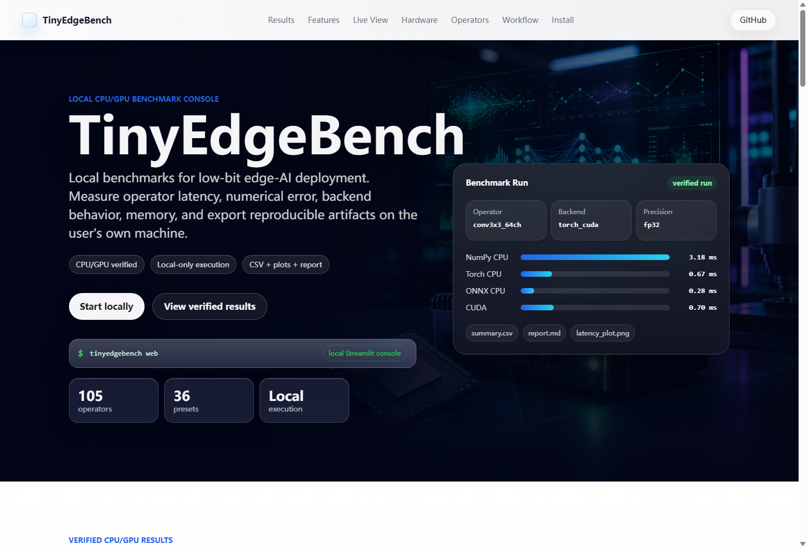

# TinyEdgeBench

[](https://www.python.org/)
[](LICENSE)
[](pyproject.toml)
[](#verified-local-cpu-and-gpu-results)
[](docs/results/rtx4060_laptop/)

TinyEdgeBench is a reproducible local benchmark suite for low-bit edge AI on the user's own CPU and GPU.

It connects operator simulation, model-block benchmarking, and real local backend comparison into one inspectable Python workflow. The goal is simple: when someone installs TinyEdgeBench on their own computer, the generated report reflects that machine's actual CPU, GPU, driver, CUDA, PyTorch, and ONNX Runtime stack.

[Website](docs/) | [Quick Start](#quick-start) | [Benchmark Protocol](docs/benchmark_protocol.md) | [Verified Results](docs/hardware_results.md) | [Roadmap](#roadmap)

## Why TinyEdgeBench

Edge-AI work often starts with practical questions:

- How fast is this operator on my laptop or edge box?
- How much error does an INT8-style approximation introduce?
- Which layer family is the likely latency bottleneck?
- Does the same workload behave differently on NumPy CPU, PyTorch CPU, ONNX Runtime CPU, PyTorch CUDA, or ONNX Runtime CUDA?
- What is the memory, power, and energy tradeoff, not only latency?

TinyEdgeBench is not a production inference runtime. It is a small, inspectable benchmarking harness for deployment decisions on local CPU/GPU machines: operator diagnosis, precision-error tradeoff, backend comparison, and reproducible report generation.

## Verified Local CPU And GPU Results

The repository now includes verified local result artifacts under [docs/results/](docs/results/). A result is treated as verified only when the directory includes the generated CSV/report/plots plus system information.

| Platform | Backend | Workload | Precision | Key Result |
| --- | --- | --- | --- | --- |
| Laptop CPU | NumPy / Torch CPU / ONNX CPU | Conv3x3 / MatMul128 | FP32 | [summary.csv](docs/results/cpu_baseline/summary.csv) with median, P90, std, RSS, error |
| RTX 4060 Laptop | Torch CUDA / ONNX CUDA plus CPU baselines | MatMul256 / Conv3x3 | FP32 | [summary.csv](docs/results/rtx4060_laptop/summary.csv) with CUDA memory and estimated energy |

## Highlights

| Capability | Status |
| --- | --- |
| Local CPU execution | Supported by default |
| YAML benchmark configs | Supported |
| Interactive CLI wizard | Supported |
| Streamlit Web UI | Supported |
| CSV, Markdown, and PNG outputs | Supported |
| 100+ operator microbenchmarks | Supported |
| 25+ network/block presets | Supported |
| Verified CPU and RTX 4060 result artifacts | Supported |
| Memory, P90/std latency, and estimated CUDA energy columns | Supported |
| Benchmark protocol documentation | Supported |
| FP32 baseline | Supported |
| Real `torch_cpu` / `onnxruntime_cpu` comparison | Optional |
| Real `torch_cuda` / `onnxruntime_cuda` comparison | Optional, local GPU required |
| ONNX Runtime TensorRT Provider comparison | Optional, local TensorRT provider required |
| OpenVINO / TVM / native TensorRT backend registry | Planned executors with availability checks |
| Model-level benchmark presets | Supported |
| Historical run comparison | Supported |
| Simulated INT8 | Supported |
| Shift-only approximation | Supported |
| CUDA/GPU execution | Supported through optional local backends |

## Installation

Clone the repository and install it in editable mode:

```bash
git clone https://github.com/keys2023190905023/TinyEdgeBench.git
cd TinyEdgeBench
python -m pip install -e ".[dev]"
```

TinyEdgeBench requires Python 3.9 or newer. CUDA is not required.

## Where Benchmarks Run

TinyEdgeBench is designed for local deployment-style measurements:

- GitHub hosts the source code, documentation, and static project website.
- GitHub Pages is only a showcase page; it cannot run CPU or GPU benchmarks for visitors.
- `python -m tinyedgebench.benchmark ...`, `tinyedgebench wizard`, and `tinyedgebench web` execute on the machine where the command is launched.
- Reported latency and error data reflect that local machine's Python environment, CPU, GPU, drivers, and installed runtimes.

This means a user with an NVIDIA GPU can run `torch_cuda` or `onnxruntime_cuda` locally and generate real local GPU measurements, while a CPU-only machine still works through the default NumPy CPU backend.

## Quick Start

Run the default benchmark suite:

```bash
python -m tinyedgebench.benchmark --config configs/default.yaml
```

Outputs are written to `results/`:

```text
results/
  summary.csv
  report.md
  latency_plot.png
  error_plot.png
```

## Web UI

Launch the local Streamlit application:

```bash
tinyedgebench web
```

Then open:

```text
http://localhost:8501
```

The Web UI runs locally on your own computer. The browser is a control panel for the local Python process, so benchmark data is generated by your own CPU/GPU environment. From the browser you can choose:

- single-operator benchmarks
- network or model-block presets
- precision modes
- tensor or matrix shapes
- warmup runs and benchmark runs
- output directory

After a run, the app shows a summary table, latency chart, numerical error chart, Markdown report preview, and download buttons for generated artifacts.

To choose a different Streamlit port:

```bash
tinyedgebench web -- --server.port 8502
```

The Web UI also supports uploaded YAML configs, historical run comparison, Plotly charts when Plotly is installed, and one-click ZIP downloads for generated reports.

## Project Website

The repository includes a static, GitHub Pages-ready website in [docs/](docs/):

```text
docs/
  index.html
  styles.css
  app.js
  assets/hero-edge-bench.png
```

To publish it on GitHub, enable Pages in the repository settings and choose `main` plus the `/docs` folder as the source.

## CLI Wizard

Use the interactive terminal wizard:

```bash
tinyedgebench wizard
```

The wizard asks for the operator, shape parameters, precision modes, backend, and output directory. CPU is the default supported backend.

## YAML Usage

Create a benchmark config:

```yaml
output_dir: results
warmup: 2
runs: 5
backend: cpu
seed: 42
benchmarks:
  - name: conv2d_small
    operator: conv2d
    input_shape: [1, 3, 16, 16]
    output_channels: 8
    kernel_size: [3, 3]
    stride: 1
    padding: 1
    precision_modes: [fp32, int8_sim, shift_only]

  - name: matmul_small
    operator: matmul
    matrix_m: 32
    matrix_k: 64
    matrix_n: 16
    precision_modes: [fp32, int8_sim, shift_only]
```

Run it:

```bash
python -m tinyedgebench.benchmark --config path/to/config.yaml
```

See [configs/default.yaml](configs/default.yaml), [configs/extended_operators.yaml](configs/extended_operators.yaml), and [configs/model_presets.yaml](configs/model_presets.yaml) for complete examples.

## Real Backend Comparison

By default, `cpu` uses the built-in NumPy benchmark path. TinyEdgeBench can also compare against real local deployment-style kernels through optional backends:

| Backend | What it measures |
| --- | --- |
| `cpu` | Default NumPy CPU implementation |
| `torch_cpu` | PyTorch CPU operator kernels |
| `torch_cuda` | PyTorch CUDA kernels on the local NVIDIA GPU |
| `onnxruntime_cpu` | ONNX Runtime CPUExecutionProvider kernels |
| `onnxruntime_cuda` | ONNX Runtime CUDAExecutionProvider kernels on the local NVIDIA GPU |
| `onnxruntime_tensorrt` | ONNX Runtime TensorrtExecutionProvider kernels when available locally |
| `openvino_cpu` | Registered CPU deployment target with availability checks; executor integration is planned |
| `tvm_cpu`, `tvm_cuda` | Registered compiler-runtime targets with availability checks; executor integration is planned |
| `tensorrt_cuda` | Registered native TensorRT target; use `onnxruntime_tensorrt` today for TensorRT-provider runs |

Install optional backend dependencies:

```bash
python -m pip install -e ".[real-backends]"
```

For ONNX Runtime CUDA provider experiments, install the GPU extra in an environment with compatible NVIDIA drivers and CUDA runtime support:

```bash
python -m pip install -e ".[real-backends-gpu]"
```

Run a backend comparison suite:

```bash
python -m tinyedgebench.benchmark --config configs/real_backends.yaml
```

Example config:

```yaml
output_dir: results_real_backends
warmup: 2
runs: 10
backends: [cpu, torch_cpu, onnxruntime_cpu]
benchmarks:
  - name: deploy_matmul
    operator: matmul
    matrix_m: 128
    matrix_k: 256
    matrix_n: 128
    precision_modes: [fp32]
```

These backend rows are measured on your local machine and reflect the installed PyTorch or ONNX Runtime kernels. ONNX Runtime benchmark graphs freeze weights as model initializers where practical, which is closer to deployment-style inference than feeding every tensor as an input. `int8_sim` and `shift_only` remain simulation modes unless a backend-specific quantized kernel is added.

Example local GPU config:

```yaml
output_dir: results_gpu_backends
warmup: 5
runs: 20
backends: [cpu, torch_cpu, torch_cuda, onnxruntime_cpu, onnxruntime_cuda]
benchmarks:
  - name: gpu_matmul_256
    operator: matmul
    matrix_m: 256
    matrix_k: 256
    matrix_n: 256
    precision_modes: [fp32]
```

See [configs/gpu_backends.example.yaml](configs/gpu_backends.example.yaml). Use CUDA backends only on a local machine where PyTorch CUDA or ONNX Runtime CUDAExecutionProvider is available.

For TensorRT Provider experiments through ONNX Runtime:

```bash
python -m tinyedgebench.benchmark --config configs/deployment_backends.example.yaml
```

If the local ONNX Runtime install does not expose `TensorrtExecutionProvider`, remove `onnxruntime_tensorrt` from the `backends` list.

## Network Presets

TinyEdgeBench can run lightweight suites that approximate common model blocks:

| Preset | Description |
| --- | --- |
| `tiny_cnn` | Conv/BN/ReLU/Pool/Linear image pipeline |
| `mobilenet_block` | Depthwise separable convolution block |
| `resnet_basic_block` | Residual Conv/BN/ReLU/Add block |
| `transformer_encoder_tiny` | Attention, normalization, MLP, and softmax block |
| `mlp_edge` | Small MLP-style matrix and activation block |
| `efficientnet_mbconv` | Mobile inverted bottleneck convolution block |
| `convnext_block` | ConvNeXt-style depthwise convolution and pointwise MLP block |
| `unet_encoder_block` | UNet downsampling encoder block |
| `unet_decoder_block` | UNet upsampling decoder block |
| `deeplab_aspp_tiny` | Tiny segmentation ASPP-style block |
| `fpn_lateral_block` | Feature pyramid lateral fusion block |
| `yolo_head_tiny` | Tiny detection head block |
| `detection_neck_pan` | PAN-style detection neck fusion block |
| `segmentation_head` | Lightweight semantic segmentation head |
| `vit_patch_embed` | Vision Transformer patch embedding block |
| `swin_window_attention_tiny` | Tiny Swin-style attention and MLP block |
| `bert_ffn_block` | BERT-style feed-forward block |
| `gpt_decoder_tiny` | Tiny causal decoder block |
| `recommender_embedding_mlp` | Embedding plus MLP recommendation block |
| `speech_command_cnn` | Small speech-command CNN block |
| `wav2vec_conv_frontend` | Speech representation frontend approximation |
| `autoencoder_bottleneck` | Encoder bottleneck and decoder projection block |
| `gan_generator_block` | Generator-style upsampling convolution block |
| `super_resolution_block` | Pixel-shuffle-like super-resolution block |
| `lstm_gate_block` | LSTM gate approximation block |
| `gru_gate_block` | GRU gate approximation block |
| `pointnet_mlp_block` | PointNet-style per-point MLP and global reduction block |
| `graphsage_mlp_block` | GraphSAGE-style aggregate and projection block |
| `anomaly_mlp` | Small anomaly-detection MLP block |
| `mobilenetv2_tiny` | Layer-wise MobileNetV2-style tiny model |
| `resnet18_tiny` | Layer-wise ResNet18-style tiny image model |
| `efficientnet_lite_tiny` | Layer-wise EfficientNet-Lite-style model |
| `yolo_tiny_head` | Layer-wise YOLO tiny detection head |
| `tinybert_block` | Layer-wise TinyBERT encoder block |
| `whisper_tiny_encoder` | Layer-wise Whisper encoder approximation |
| `llama_mlp_attention_micro` | Layer-wise LLaMA attention and MLP microbenchmark |

Run model-level presets:

```bash
python -m tinyedgebench.benchmark --config configs/model_level.yaml
```

## Historical Comparison

Save a timestamped copy of a run:

```bash
python -m tinyedgebench.benchmark --config configs/default.yaml --history
```

This writes the normal output directory and also copies artifacts into:

```text
results/runs/<timestamp>/
```

Compare two saved runs:

```bash
tinyedgebench compare results/runs/<baseline> results/runs/<candidate>
```

The comparison generates:

```text
results/compare/
  comparison.csv
  comparison.md
```

Example:

```yaml
network_presets:
  - name: tiny_cnn
    precision_modes: [fp32, int8_sim, shift_only]
  - name: transformer_encoder_tiny
    precision_modes: [fp32, int8_sim]
```

## Supported Operators

| Category | Operators |
| --- | --- |
| Convolution | `conv2d`, `depthwise_conv2d`, `pointwise_conv2d` |
| Matrix and linear | `matmul`, `batch_matmul`, `linear` |
| Activations | `relu`, `relu6`, `sigmoid`, `tanh`, `gelu`, `silu`, `leaky_relu`, `elu`, `selu`, `celu`, `softplus`, `softsign`, `hard_sigmoid`, `hard_swish`, `mish`, `prelu`, `glu`, `swiglu`, `geglu` |
| Pooling and image ops | `maxpool2d`, `avgpool2d`, `global_avgpool2d`, `upsample_nearest2d`, `pad` |
| Normalization | `batchnorm2d`, `layernorm`, `rmsnorm`, `groupnorm`, `instance_norm`, `l2_normalize` |
| Tensor ops | `add`, `sub`, `mul`, `div`, `maximum`, `minimum`, `bias_add`, `where`, `masked_fill`, `greater`, `less`, `equal`, `not_equal`, `concat`, `transpose`, `reshape`, `flatten`, `squeeze`, `expand_dims`, `tile`, `slice`, `gather`, `one_hot` |
| Layout/image transforms | `channel_shuffle`, `space_to_depth`, `depth_to_space` |
| Pooling extras | `adaptive_avgpool2d`, `adaptive_maxpool2d` |
| Reductions and probabilities | `softmax`, `log_softmax`, `reduce_mean`, `reduce_sum`, `reduce_max`, `reduce_min`, `reduce_prod`, `argmax`, `argmin`, `topk`, `sort`, `cumsum`, `cumprod` |
| Unary math | `identity`, `abs`, `neg`, `square`, `sqrt`, `rsqrt`, `exp`, `log`, `log1p`, `pow`, `sin`, `cos`, `reciprocal`, `floor`, `ceil`, `round`, `clip`, `sign`, `standardize`, `minmax_normalize`, `pixel_norm`, `dropout_inference` |
| Similarity and distance | `cosine_similarity`, `pairwise_distance` |
| Sequence/model ops | `embedding`, `scaled_dot_product_attention`, `causal_self_attention`, `rotary_embedding` |

## Precision Modes

| Mode | Meaning |
| --- | --- |
| `fp32` | Float32 reference path |
| `int8_sim` | Symmetric INT8-style quantization simulation with float dequantization |
| `shift_only` | Signed power-of-two operand approximation for shift-like experiments |

## Output Files

| File | Purpose |
| --- | --- |
| `summary.csv` | Machine-readable benchmark summary |
| `report.md` | Markdown report with system information and result table |
| `latency_plot.png` | Latency comparison chart |
| `error_plot.png` | Numerical error chart |

The report records the local execution machine, operating system, Python version, CPU/GPU information, CUDA visibility, PyTorch CUDA status, ONNX Runtime providers, backend ranking, bottleneck rows, memory fields, optional CUDA power/energy estimates, and reproducibility commands.

## Example CSV

```csv
name,operator,precision,backend,input_description,latency_ms,throughput_ops_per_s,mean_abs_error,max_abs_error,latency_median_ms,latency_p90_ms,latency_std_ms,valid_runs,failed_runs,oom_runs,peak_memory_mb,gpu_memory_allocated_mb,gpu_memory_reserved_mb,power_w,energy_mj,edp_mj_ms,preprocess_ms,inference_ms,postprocess_ms
rtx4060_matmul_256,matmul,fp32,onnxruntime_cuda,256x256 @ 256x256,0.539750,62166617878.78,0.00093977,0.00499487,0.539750,0.653900,0.082526,20,0,0,584.684,,,14.213,7.672,4.141,0.000000,0.539750,0.000000
```

## Project Layout

```text
TinyEdgeBench/
  benchmark_suites/          story-driven benchmark suites
  configs/                  YAML benchmark examples
  docs/
    benchmark_protocol.md    reproducibility and measurement protocol
    hardware_results.md      verified hardware result index
    results/                 CPU/GPU benchmark artifacts
  src/tinyedgebench/         package source
    benchmark.py             YAML entry point
    cli.py                   CLI commands
    web_app.py               Streamlit application
    runner.py                benchmark orchestration
    operators.py             NumPy operator implementations
    artifacts.py             CSV, report, and plot generation
    network_presets.py       common model-block presets
  tests/                     pytest suite
```

## Development

Install development dependencies:

```bash
python -m pip install -e ".[dev]"
```

Run tests:

```bash
python -m pytest
```

Run end-to-end examples:

```bash
python -m tinyedgebench.benchmark --config configs/default.yaml
python -m tinyedgebench.benchmark --config configs/extended_operators.yaml
python -m tinyedgebench.benchmark --config configs/model_presets.yaml
python -m tinyedgebench.benchmark --config configs/model_level.yaml
python -m tinyedgebench.benchmark --config configs/real_backends.yaml
```

If your local machine has CUDA-enabled PyTorch and/or ONNX Runtime GPU providers:

```bash
python -m tinyedgebench.benchmark --config configs/gpu_backends.example.yaml
```

## Screenshots

Static project website with the refined local benchmark dashboard:



## Continuous Integration

The repository includes GitHub Actions CI in `.github/workflows/ci.yml`. It installs the package, runs `pytest`, and verifies the default YAML config on every push and pull request.

## Roadmap

- More CPU/GPU deployment backends such as CuPy, OpenVINO CPU, TensorRT, and TVM
- Backend-specific quantized INT8 kernels beyond the current simulation path
- More fused kernels and model-specific operator groups
- PyPI release packaging and versioned benchmark artifacts

## License

TinyEdgeBench is released under the MIT License. See [LICENSE](LICENSE).
