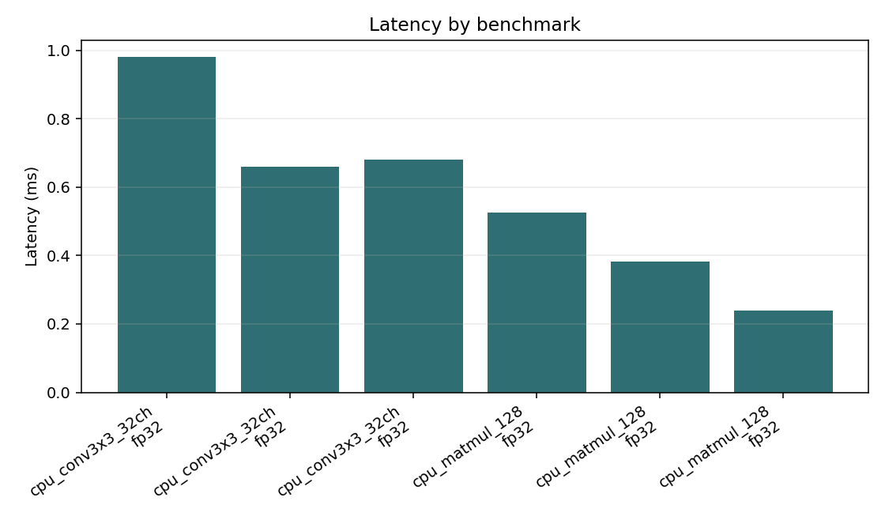
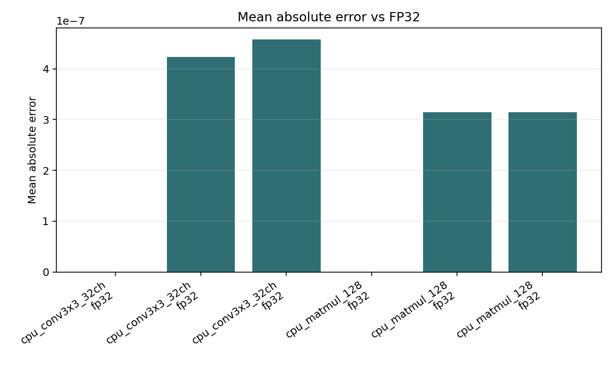

# TinyEdgeBench Report

## System Information

- Execution location: local machine running this benchmark command or Streamlit app.
- Operating system: Windows 10 (AMD64)
- Python version: 3.9.13 (main, Aug 25 2022, 23:51:50) [MSC v.1916 64 bit (AMD64)]
- CPU information: Intel64 Family 6 Model 170 Stepping 4, GenuineIntel
- CUDA available: True
- GPU information: NVIDIA GeForce RTX 4060 Laptop GPU, 8188 MiB
- PyTorch version: 2.5.1+cu121
- PyTorch CUDA available: True
- PyTorch CUDA version: 12.1
- ONNX Runtime version: 1.19.2
- ONNX Runtime providers: TensorrtExecutionProvider, CUDAExecutionProvider, CPUExecutionProvider

## Executive Summary

- Benchmarks executed: 6 result rows.
- Fastest row: `cpu_matmul_128` on `onnxruntime_cpu` / `fp32` at 0.2392 ms.
- Slowest row: `cpu_conv3x3_32ch` on `cpu` / `fp32` at 0.9807 ms.
- Highest mean absolute error: 0.000000.
- Highest observed process RSS: 420.488 MB.

## Backend Ranking

| Backend | Median Latency (ms) | Rows |
| --- | ---: | ---: |
| onnxruntime_cpu | 0.4597 | 2 |
| torch_cpu | 0.5206 | 2 |
| cpu | 0.7535 | 2 |

## Bottleneck Rows

| Benchmark | Operator | Precision | Backend | Latency (ms) |
| --- | --- | --- | --- | ---: |
| cpu_conv3x3_32ch | conv2d | fp32 | cpu | 0.9807 |
| cpu_conv3x3_32ch | conv2d | fp32 | onnxruntime_cpu | 0.6801 |
| cpu_conv3x3_32ch | conv2d | fp32 | torch_cpu | 0.6585 |
| cpu_matmul_128 | matmul | fp32 | cpu | 0.5262 |
| cpu_matmul_128 | matmul | fp32 | torch_cpu | 0.3827 |

## Reproduce

Run the same YAML config on the target machine with:

```bash
python -m tinyedgebench.benchmark --config path/to/config.yaml --history
```

Compare two saved runs with:

```bash
tinyedgebench compare results/runs/<baseline> results/runs/<candidate>
```

## Results

| Benchmark | Operator | Precision | Backend | Median (ms) | P90 (ms) | Std (ms) | Peak RSS (MB) | Power (W) | Energy (mJ) | Mean Abs Error |
| --- | --- | --- | --- | ---: | ---: | ---: | ---: | ---: | ---: | ---: |
| cpu_conv3x3_32ch | conv2d | fp32 | cpu | 0.9807 | 1.5100 | 0.3186 | 59.766 |  |  | 0.000000 |
| cpu_conv3x3_32ch | conv2d | fp32 | torch_cpu | 0.6585 | 0.9491 | 0.2037 | 396.496 |  |  | 0.000000 |
| cpu_conv3x3_32ch | conv2d | fp32 | onnxruntime_cpu | 0.6801 | 9.0086 | 3.6451 | 419.742 |  |  | 0.000000 |
| cpu_matmul_128 | matmul | fp32 | cpu | 0.5262 | 0.7528 | 0.2281 | 419.828 |  |  | 0.000000 |
| cpu_matmul_128 | matmul | fp32 | torch_cpu | 0.3827 | 0.4715 | 0.1010 | 419.211 |  |  | 0.000000 |
| cpu_matmul_128 | matmul | fp32 | onnxruntime_cpu | 0.2392 | 1.6801 | 1.1428 | 420.488 |  |  | 0.000000 |

## Plots





## Notes

- `int8_sim` uses symmetric int8 quantization with int32 accumulation and float dequantization.
- `shift_only` rounds operands to signed powers of two to approximate shift-only arithmetic.
- `cpu` is the default NumPy backend and remains available without optional dependencies.
- `torch_cpu`, `torch_cuda`, `onnxruntime_cpu`, and `onnxruntime_cuda` measure real local backend kernels when the matching optional dependencies and hardware are available.
- Real backend comparison currently reports FP32 timings; `int8_sim` and `shift_only` are simulation modes unless a backend-specific quantized kernel is added.
- CPU memory uses process RSS when `psutil` is installed; CUDA memory uses PyTorch peak allocation/reservation for `torch_cuda` runs.
- Power and energy are opportunistic estimates from `nvidia-smi power.draw` for CUDA-style backends; use an external meter or board-side logger for publishable energy numbers.
- GitHub Pages can showcase the project, but benchmark data is generated only on the machine where TinyEdgeBench is run.
- FPGA and NPU backends are roadmap items.
