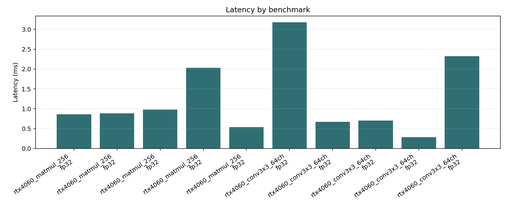
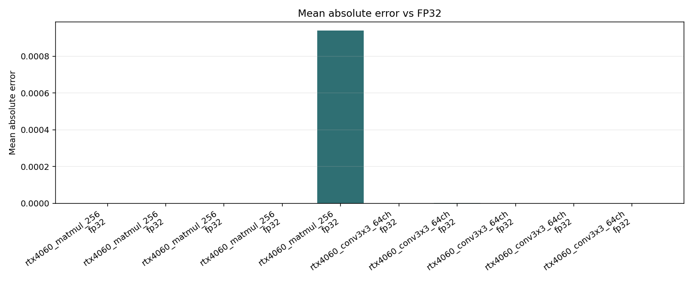

# TinyEdgeBench Report

## System Information

- Execution location: local machine running this benchmark command or Streamlit app.
- Operating system: Windows 10 (AMD64)
- Python version: 3.9.13 (main, Aug 25 2022, 23:51:50) [MSC v.1916 64 bit (AMD64)]
- CPU information: Intel64 Family 6 Model 170 Stepping 4, GenuineIntel
- CUDA available: True
- GPU information: NVIDIA GeForce RTX 4060 Laptop GPU, 8188 MiB
- PyTorch version: 2.5.1+cu121
- PyTorch CUDA available: True
- PyTorch CUDA version: 12.1
- ONNX Runtime version: 1.19.2
- ONNX Runtime providers: TensorrtExecutionProvider, CUDAExecutionProvider, CPUExecutionProvider

## Executive Summary

- Benchmarks executed: 10 result rows.
- Fastest row: `rtx4060_conv3x3_64ch` on `onnxruntime_cpu` / `fp32` at 0.2810 ms.
- Slowest row: `rtx4060_conv3x3_64ch` on `cpu` / `fp32` at 3.1782 ms.
- Highest mean absolute error: 0.000940.
- Highest observed process RSS: 842.547 MB.

## Backend Ranking

| Backend | Median Latency (ms) | Rows |
| --- | ---: | ---: |
| torch_cpu | 0.7802 | 2 |
| torch_cuda | 0.8407 | 2 |
| onnxruntime_cpu | 1.1545 | 2 |
| onnxruntime_cuda | 1.4318 | 2 |
| cpu | 2.0212 | 2 |

## Bottleneck Rows

| Benchmark | Operator | Precision | Backend | Latency (ms) |
| --- | --- | --- | --- | ---: |
| rtx4060_conv3x3_64ch | conv2d | fp32 | cpu | 3.1782 |
| rtx4060_conv3x3_64ch | conv2d | fp32 | onnxruntime_cuda | 2.3238 |
| rtx4060_matmul_256 | matmul | fp32 | onnxruntime_cpu | 2.0280 |
| rtx4060_matmul_256 | matmul | fp32 | torch_cuda | 0.9786 |
| rtx4060_matmul_256 | matmul | fp32 | torch_cpu | 0.8873 |

## Reproduce

Run the same YAML config on the target machine with:

```bash
python -m tinyedgebench.benchmark --config path/to/config.yaml --history
```

Compare two saved runs with:

```bash
tinyedgebench compare results/runs/<baseline> results/runs/<candidate>
```

## Results

| Benchmark | Operator | Precision | Backend | Median (ms) | P90 (ms) | Std (ms) | Peak RSS (MB) | Power (W) | Energy (mJ) | Mean Abs Error |
| --- | --- | --- | --- | ---: | ---: | ---: | ---: | ---: | ---: | ---: |
| rtx4060_matmul_256 | matmul | fp32 | cpu | 0.8643 | 1.0930 | 0.1596 | 59.242 |  |  | 0.000000 |
| rtx4060_matmul_256 | matmul | fp32 | torch_cpu | 0.8873 | 4.1239 | 1.4897 | 396.391 |  |  | 0.000000 |
| rtx4060_matmul_256 | matmul | fp32 | torch_cuda | 0.9786 | 1.3983 | 0.2190 | 513.652 | 14.206 | 13.902 | 0.000001 |
| rtx4060_matmul_256 | matmul | fp32 | onnxruntime_cpu | 2.0280 | 5.6945 | 2.5598 | 538.941 |  |  | 0.000000 |
| rtx4060_matmul_256 | matmul | fp32 | onnxruntime_cuda | 0.5397 | 0.6539 | 0.0825 | 584.684 | 14.213 | 7.672 | 0.000940 |
| rtx4060_conv3x3_64ch | conv2d | fp32 | cpu | 3.1782 | 3.4806 | 0.3114 | 589.773 |  |  | 0.000000 |
| rtx4060_conv3x3_64ch | conv2d | fp32 | torch_cpu | 0.6731 | 0.7922 | 0.0781 | 595.141 |  |  | 0.000001 |
| rtx4060_conv3x3_64ch | conv2d | fp32 | torch_cuda | 0.7028 | 1.0580 | 0.1843 | 697.715 | 13.502 | 9.490 | 0.000001 |
| rtx4060_conv3x3_64ch | conv2d | fp32 | onnxruntime_cpu | 0.2810 | 0.3376 | 0.0649 | 705.547 |  |  | 0.000001 |
| rtx4060_conv3x3_64ch | conv2d | fp32 | onnxruntime_cuda | 2.3238 | 2.4826 | 0.2563 | 842.547 | 5.738 | 13.333 | 0.000001 |

## Plots





## Notes

- `int8_sim` uses symmetric int8 quantization with int32 accumulation and float dequantization.
- `shift_only` rounds operands to signed powers of two to approximate shift-only arithmetic.
- `cpu` is the default NumPy backend and remains available without optional dependencies.
- `torch_cpu`, `torch_cuda`, `onnxruntime_cpu`, and `onnxruntime_cuda` measure real local backend kernels when the matching optional dependencies and hardware are available.
- Real backend comparison currently reports FP32 timings; `int8_sim` and `shift_only` are simulation modes unless a backend-specific quantized kernel is added.
- CPU memory uses process RSS when `psutil` is installed; CUDA memory uses PyTorch peak allocation/reservation for `torch_cuda` runs.
- Power and energy are opportunistic estimates from `nvidia-smi power.draw` for CUDA-style backends; use an external meter or board-side logger for publishable energy numbers.
- GitHub Pages can showcase the project, but benchmark data is generated only on the machine where TinyEdgeBench is run.
- FPGA and NPU backends are roadmap items.
